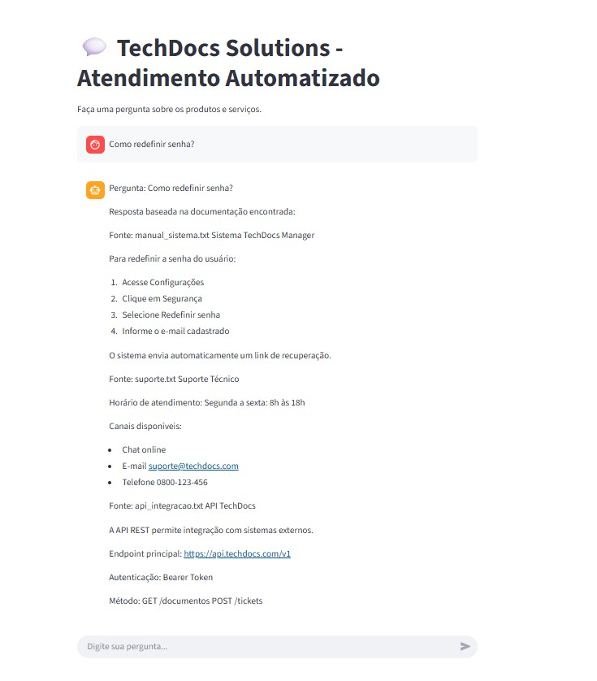

# TechDocs Solutions - Chatbot de Atendimento Automatizado

## 📌 Descrição do Projeto

Este projeto implementa um sistema de atendimento automatizado baseado em Inteligência Artificial para a empresa fictícia **TechDocs Solutions**. O chatbot foi desenvolvido para responder dúvidas dos clientes utilizando a documentação técnica da empresa como fonte de conhecimento.

A solução utiliza **embeddings**, **busca vetorial** e uma arquitetura **ChatWithDocs (RAG - Retrieval Augmented Generation)** para localizar trechos relevantes da documentação e gerar respostas contextualizadas.

---
## 🚀 Aplicação Online

[▶️ Abrir Chatbot no Streamlit](https://techdocs-chatbot-emb.streamlit.app/)

---

## 🎯 Objetivo

Desenvolver um chatbot capaz de:

* Interpretar perguntas dos usuários
* Buscar informações relevantes na documentação técnica
* Fornecer respostas rápidas e precisas
* Reduzir a carga do suporte técnico humano

---

## 🧠 Tecnologias Utilizadas

* Python 3.11
* Sentence Transformers (embeddings)
* FAISS (busca vetorial)
* Streamlit (interface do chatbot)
* NumPy
* Pandas (métricas)

---

## 🏗️ Arquitetura da Solução

Fluxo do sistema:

1. Documentação técnica é carregada
2. Textos são divididos em trechos (chunking)
3. Embeddings são gerados
4. Vetores são indexados com FAISS
5. Pergunta do usuário é convertida em embedding
6. Busca vetorial encontra trechos mais relevantes
7. Chatbot retorna resposta baseada na documentação

---

## 📁 Estrutura do Projeto

```
Projeto TechDocs-Solutions
│
├── data
│   └── docs
│       ├── manual_sistema.txt
│       ├── api_integracao.txt
│       └── suporte.txt
│
├── vectorstore
│
├── ingest.py
├── chatbot.py
├── app.py
├── metrics.py
└── README.md
```

---
## 📸 Exemplo de Execução

<p align="center">
  
</p>
---

## ⚙️ Instalação

Instale as dependências:

```
pip install streamlit sentence-transformers faiss-cpu numpy pandas scikit-learn
```

---

## ▶️ Como Executar

### 1. Gerar base vetorial

```
python ingest.py
```

---

### 2. Executar o chatbot

```
python -m streamlit run app.py
```

O sistema abrirá automaticamente no navegador.

---

### 3. Testar métricas

```
python metrics.py
```

---

## 💬 Exemplos de Perguntas

* Como redefinir senha?
* Qual o horário de atendimento?
* Qual endpoint da API?
* Como entrar em contato com suporte?

---

## 📊 Métricas Avaliadas

* Tempo de resposta
* Taxa de acerto
* Precisão da recuperação
* Eficiência da busca vetorial

---

## 🧪 Metodologia

A solução utiliza abordagem **RAG (Retrieval-Augmented Generation)**, onde o chatbot não possui conhecimento fixo, mas consulta dinamicamente a documentação técnica.

Isso garante:

* respostas atualizáveis
* menor alucinação
* maior precisão
* rastreabilidade das fontes

---

## 🚀 Melhorias Futuras

* Suporte a PDF e DOCX
* Integração com LLM (OpenAI / Gemini)
* Ranking semântico avançado
* Feedback do usuário
* Histórico de conversas
* Deploy em nuvem

---

## 👨‍💻 Autor
Lari Pelissari 

Projeto desenvolvido como atividade acadêmica na disciplina:

**Inteligência Artificial e Machine Learning – Analytics e IA Generativa**

---

## 📄 Licença

Projeto acadêmico para fins educacionais.
